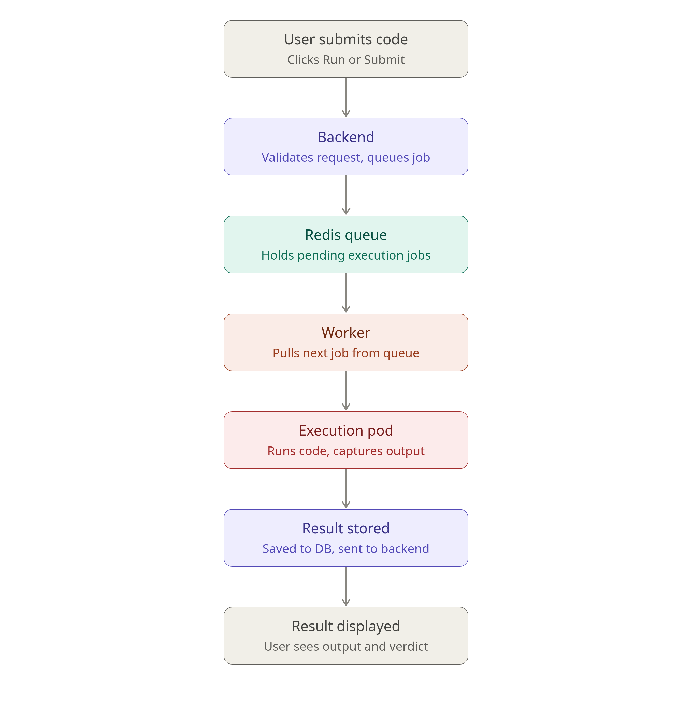

# CodeSoft

CodeSoft is a web-based code execution platform focused on solving programming problems, submitting code, and viewing execution results.

The project is being developed as a full-stack and DevOps portfolio project. The frontend is implemented as a lightweight static application using vanilla HTML, CSS, and JavaScript. The current backend uses FastAPI, SQLite, and a worker/queue execution layer; containerization, hardened isolation, CI/CD, Kubernetes, and monitoring will be added progressively.

## Current Status

The current version includes a working FastAPI backend with SQLite persistence and real Python subprocess evaluation. C++ and Java still use the deterministic fallback judge, and the execution process is not yet a hardened public sandbox.

## Workflow chart




Implemented:

- Login and registration UI
- Demo authentication and role-based page access
- Problem catalogue with search and filtering
- Problem-solving workspace
- Language selection and starter code
- Run and Submit flows
- Backend execution results
- Submission history
- User profile
- Basic admin problem management
- API abstraction layer prepared for the FastAPI backend

The frontend sends run and submit requests to the backend when `useMock` is `false` in `frontend/js/config.js`. Python submissions are evaluated in a timeout-limited subprocess. The mock judge remains available as a frontend development fallback, but it is not the normal backend mode.

## Technology

Current frontend:

- HTML
- CSS
- Vanilla JavaScript
- ES modules

Current and planned application stack:

- FastAPI
- SQLite during early development
- PostgreSQL later
- Redis
- Worker-based code execution
- Docker
- Nginx
- Kubernetes
- GitHub Actions
- Prometheus
- Grafana

## Frontend Structure

```text
frontend/
├── html/
├── css/
├── js/
│   ├── api/
│   ├── components/
│   ├── pages/
│   └── ...
├── data/
├── index.html
├── login.html
├── register.html
├── problems.html
├── problem.html
├── submissions.html
├── profile.html
└── admin.html
```

The exact directory layout may evolve as development continues.

## Running the application locally

### Prerequisites

- Python 3.10 or newer
- PowerShell on Windows, or an equivalent terminal
- Redis is optional for local development because the backend falls back to an in-memory queue

### Install the backend dependencies

From the repository root:

```powershell
python -m pip install -r requirements.txt
```

### Start the full application

Run this from the repository root:

```powershell
python -m uvicorn main:app --host 0.0.0.0 --port 8000
```

Then open:

```text
http://127.0.0.1:8000/login.html
```

The FastAPI application serves both the `/api` routes and the static files in `frontend/`, so a separate frontend server is not needed for the normal workflow.

If port 8000 is already in use, use another port:

```powershell
python -m uvicorn main:app --host 0.0.0.0 --port 8001
```

Then open `http://127.0.0.1:8001/login.html`.

### Test the backend without the browser

Check that the application imports:

```powershell
python -c "import main; print('import-ok')"
```

With Uvicorn running, check the health endpoint:

```powershell
Invoke-RestMethod http://127.0.0.1:8000/api/health
```

Log in with the seeded demo account:

```powershell
$body = '{"email":"demo@codesoft.dev","password":"demo-pass-1"}'
Invoke-RestMethod http://127.0.0.1:8000/api/auth/login -Method Post -ContentType 'application/json' -Body $body
```

The response should include a token such as `demo.u_demo`. Use that token to list problems:

```powershell
Invoke-RestMethod http://127.0.0.1:8000/api/problems
```

For a complete run/submit example, see [explanation.md](explanation.md).

### Optional Redis setup

Redis is not required for the local fallback mode. If a Redis server is available, set its URL before starting Uvicorn:

```powershell
$env:REDIS_URL = "redis://localhost:6379/0"
python -m uvicorn main:app --host 0.0.0.0 --port 8000
```

The worker tries Redis first and uses the in-memory queue if Redis cannot be reached.

## Running only the frontend

The frontend uses ES modules, so it should be served through HTTP rather than opened directly with `file://`. This mode is useful for frontend-only work; it does not provide the FastAPI backend.

```bash
cd frontend
python -m http.server 8080
```

Then open:

```text
http://127.0.0.1:8080/login.html
```

## Demo Accounts

The current frontend includes two demo accounts:

```text
User
Email: demo@codesoft.dev
Password: demo-pass-1

Admin
Email: admin@codesoft.dev
Password: admin-pass-1
```

These accounts exist only for frontend demonstration and are not suitable for production use.

## Backend and execution notes

The main backend files are:

- `main.py` — FastAPI routes, authentication, startup, and frontend serving
- `database.py` — SQLite initialization, seed data, and persistence helpers
- `worker.py` — Redis/in-memory queue, worker thread, and code evaluation
- `requirements.txt` — Python dependencies
- `agent.md` — concise project context and milestone notes
- `explanation.md` — detailed developer guide and troubleshooting reference

The current `/api/run` and `/api/submissions` flow enqueues a job and then processes it synchronously so the existing frontend receives a complete result immediately. The background worker and queue abstraction establish the next step toward asynchronous processing, but status polling and durable job tracking are not implemented yet.

## Mock Data and Execution

Problem data is currently stored in the frontend data modules.

The frontend mock judge does not execute submitted code. It returns deterministic results based on the submitted source and is only used when `useMock` is enabled. In the normal backend configuration, Python code is evaluated by `worker.py`; C++ and Java currently use the legacy deterministic fallback.

Current simulated results include:

- Accepted
- Wrong Answer
- Compilation Error
- Runtime Error
- Time Limit Exceeded

## Backend Integration

The frontend is already structured around an API layer.

Configuration is centralized in:

```text
frontend/js/config.js
```

The intended API base is:

```text
/api
```

The FastAPI backend is now available locally:

1. Start FastAPI with the command in [Running the application locally](#running-the-application-locally).
2. Keep `useMock` set to `false` in `frontend/js/config.js`.
3. Keep the API base as `/api`.
4. For a production deployment, configure Nginx to proxy `/api` to FastAPI.

The frontend should not contain hard-coded machine IP addresses.

## Planned Architecture

The intended application flow is:

```text
Browser
   |
   v
Nginx / Ingress
   |
   +--> Frontend
   |
   +--> FastAPI
           |
           +--> PostgreSQL
           |
           +--> Redis
                    |
                    v
                  Worker
                    |
                    v
             Isolated execution
                    |
                    v
                  Result
```

The execution environment will eventually be isolated from the main application and managed through container-based workloads, with Kubernetes used later for orchestration.

## Development Roadmap

The project will be developed in stages:

1. Complete the frontend
2. Build the FastAPI backend
3. Add PostgreSQL
4. Connect the frontend to the backend
5. Implement the real execution worker
6. Add Redis-based job processing
7. Containerize the application with Docker
8. Add Nginx reverse proxying
9. Host on a Linux server
10. Add HTTPS
11. Add CI/CD with GitHub Actions
12. Deploy to AWS within the available free-tier/free-credit constraints
13. Move application orchestration to Kubernetes
14. Add Prometheus and Grafana
15. Add logging, alerting, security hardening, and failure testing

## Notes

The frontend is intentionally framework-free and lightweight. The goal is to keep the product functional and understandable while using the deployment and infrastructure layers to demonstrate practical DevOps skills.

For frontend-specific implementation decisions and current demo behavior, see `agent.md`.
