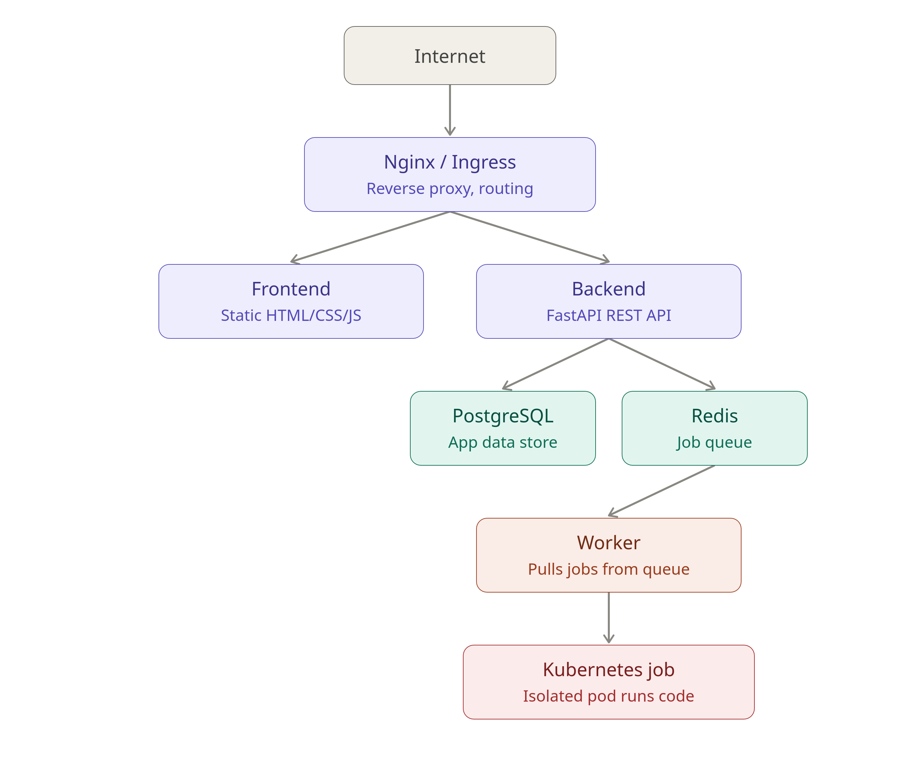

# CodeSoft

CodeSoft is a web-based code execution platform focused on solving programming problems, submitting code, and viewing execution results.

The project is being developed as a full-stack and DevOps portfolio project. The frontend is currently implemented as a lightweight static application using vanilla HTML, CSS, and JavaScript. The backend, execution infrastructure, containerization, CI/CD, Kubernetes, and monitoring will be added progressively.

## Current Status

The current version contains the basic frontend and uses mock data and a deterministic mock judge.

## Workflow chart




Implemented:

- Login and registration UI
- Demo authentication and role-based page access
- Problem catalogue with search and filtering
- Problem-solving workspace
- Language selection and starter code
- Run and Submit flows
- Mock execution results
- Submission history
- User profile
- Basic admin problem management
- API abstraction layer prepared for the FastAPI backend

The frontend does not execute user code yet. The current judge only simulates execution results for UI development.

## Technology

Current frontend:

- HTML
- CSS
- Vanilla JavaScript
- ES modules

Planned application stack:

- FastAPI
- PostgreSQL
- Redis
- Worker-based code execution
- Docker
- Nginx
- Kubernetes
- GitHub Actions
- Prometheus
- Grafana

## Frontend Structure

```text
frontend/
├── html/
├── css/
├── js/
│   ├── api/
│   ├── components/
│   ├── pages/
│   └── ...
├── data/
├── index.html
├── login.html
├── register.html
├── problems.html
├── problem.html
├── submissions.html
├── profile.html
└── admin.html
```

The exact directory layout may evolve as development continues.

## Running the Frontend

The frontend uses ES modules, so it should be served through HTTP rather than opened directly with `file://`.

```bash
cd frontend
python -m http.server 8080
```

Then open:

```text
http://127.0.0.1:8080/login.html
```

## Demo Accounts

The current frontend includes two demo accounts:

```text
User
Email: demo@codesoft.dev
Password: demo-pass-1

Admin
Email: admin@codesoft.dev
Password: admin-pass-1
```

These accounts exist only for frontend demonstration and are not suitable for production use.

## Mock Data and Execution

Problem data is currently stored in the frontend data modules.

The mock judge does not execute submitted code. It returns deterministic results based on the submitted source so the execution workflow can be developed before the backend exists.

Current simulated results include:

- Accepted
- Wrong Answer
- Compilation Error
- Runtime Error
- Time Limit Exceeded

## Backend Integration

The frontend is already structured around an API layer.

Configuration is centralized in:

```text
frontend/js/config.js
```

The intended API base is:

```text
/api
```

When the FastAPI backend is available:

1. Implement the documented `/api` routes.
2. Configure Nginx to proxy `/api` to FastAPI.
3. Set `useMock` to `false` in `frontend/js/config.js`.
4. Keep the API base as `/api`.

The frontend should not contain hard-coded machine IP addresses.

## Planned Architecture

The intended application flow is:

```text
Browser
   |
   v
Nginx / Ingress
   |
   +--> Frontend
   |
   +--> FastAPI
           |
           +--> PostgreSQL
           |
           +--> Redis
                    |
                    v
                  Worker
                    |
                    v
             Isolated execution
                    |
                    v
                  Result
```

The execution environment will eventually be isolated from the main application and managed through container-based workloads, with Kubernetes used later for orchestration.

## Development Roadmap

The project will be developed in stages:

1. Complete the frontend
2. Build the FastAPI backend
3. Add PostgreSQL
4. Connect the frontend to the backend
5. Implement the real execution worker
6. Add Redis-based job processing
7. Containerize the application with Docker
8. Add Nginx reverse proxying
9. Host on a Linux server
10. Add HTTPS
11. Add CI/CD with GitHub Actions
12. Deploy to AWS within the available free-tier/free-credit constraints
13. Move application orchestration to Kubernetes
14. Add Prometheus and Grafana
15. Add logging, alerting, security hardening, and failure testing

## Notes

The frontend is intentionally framework-free and lightweight. The goal is to keep the product functional and understandable while using the deployment and infrastructure layers to demonstrate practical DevOps skills.

For frontend-specific implementation decisions and current demo behavior, see `agent.md`.
